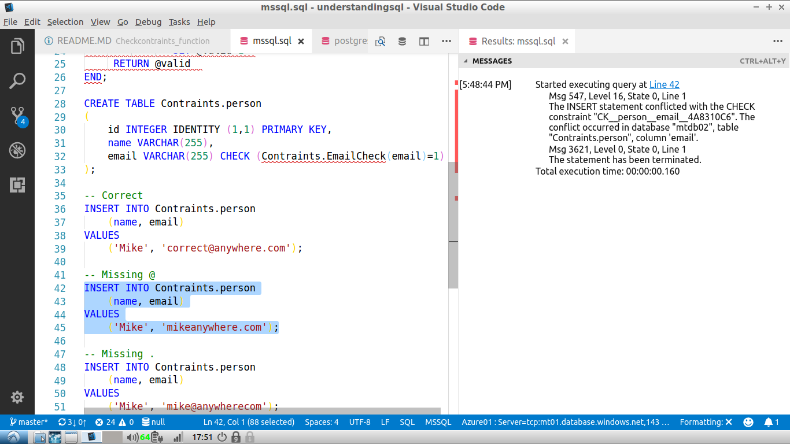

# CHECK CONSTRAINTS USING CUSTOM FUNCTIONS

Advance:
* create extended check conditions
* data consistency

SQL Feature | Postgresql | MS SQL Server | MySQL | SQLite |
------------|:----------:|:----------:|:----------:|:----------:|
CHECK (logical expression) | [X](https://www.postgresql.org/docs/current/static/sql-createtable.html) | [X](https://docs.microsoft.com/de-de/sql/t-sql/statements/create-table-transact-sql) |  - | - |

    (TSQL)
    CREATE SCHEMA Contraints;

    CREATE FUNCTION Contraints.EmailCheck(@email VARCHAR(255))   
    --Returns true if the string is a valid email address.  
    RETURNS bit   
    as  
    BEGIN  
     DECLARE @valid bit  
     IF @email IS NOT NULL   
          SET @email = LOWER(@email)  
          SET @valid = 0  
          IF @email like '[a-z,0-9,_,-]%@[a-z,0-9,_,-]%.[a-z][a-z]%'   
             AND @email NOT like '%@%@%'  
             AND CHARINDEX('.@',@email) = 0  
             AND CHARINDEX('..',@email) = 0  
             AND CHARINDEX(',',@email) = 0  
             AND RIGHT(@email,1) between 'a' AND 'z'  
               SET @valid=1  
     RETURN @valid  
    END;
    
    CREATE TABLE Contraints.person
    (
    id INTEGER IDENTITY (1,1) PRIMARY KEY,
    name VARCHAR(255),
    email VARCHAR(255) CHECK (Contraints.EmailCheck(email)=1)
    );

    -- Missing @
    INSERT INTO Contraints.person
    (name, email)
    VALUES
    ('Mike', 'mikeanywhere.com');

