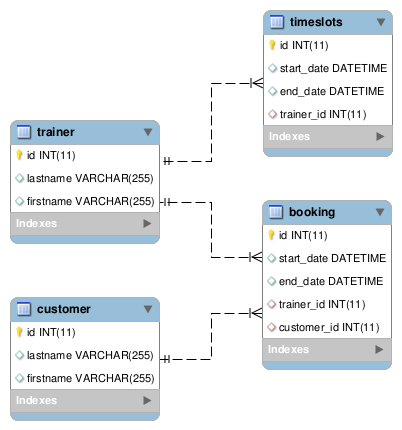

# SQL for Timetabling (Class / Course / Booking)

Some common questions regarding timetables. For SQL practice purposes with focus on expanded SQL.

## ERM

## Tables and Sample Data (Code for MS SQL Server)

    CREATE SCHEMA Timetabling;

    CREATE TABLE Timetabling.customer
    (
        id INTEGER IDENTITY (1,1) PRIMARY KEY,
        lastname VARCHAR(255),
        firstname VARCHAR(255)
    );

    CREATE TABLE Timetabling.trainer
    (
        id INTEGER IDENTITY (1,1) PRIMARY KEY,
        lastname VARCHAR(255),
        firstname VARCHAR(255)
    );

    CREATE TABLE Timetabling.booking
    (
        id INTEGER IDENTITY (1,1) PRIMARY KEY,
        start_date DATETIME,
        end_date DATETIME,
        trainer_id INT,
        customer_id INT,
        FOREIGN KEY (trainer_id) REFERENCES Timetabling.trainer(id),
        FOREIGN KEY (customer_id) REFERENCES Timetabling.customer(id)
    );

    CREATE TABLE Timetabling.timeslots
    (
        id INTEGER IDENTITY (1,1) PRIMARY KEY,
        start_date DATETIME,
        end_date DATETIME,
        trainer_id INT,
        FOREIGN KEY (trainer_id) REFERENCES Timetabling.trainer(id)
    )

We need some sample random data to test the queries.

    INSERT INTO Timetabling.customer
        (lastname, firstname)
    VALUES
        ('White', 'Jack'),
        ('Black', 'Emily'),
        ('Cook', 'Thomas'),
        ('Day', 'Oscar');

    INSERT INTO Timetabling.trainer
        (lastname, firstname)
    VALUES
        ('Mills', 'Daniel'),
        ('Thompason', 'Harry'),
        ('Watts', 'Jessica'),
        ('McNab', 'Mia');

    -- Generate Timeslots for trainer
    declare @StartTime datetime = CONVERT(CHAR(10),GETDATE(),121),
    @EndTime datetime = DATEADD(DAY,30,GETDATE()),
    @Interval int = 3600 -- one hour
    
    ;WITH cSequence AS
    (
            SELECT @StartTime AS StartRange, CONVERT(DATETIME, CONVERT(VARCHAR(13),DATEADD(SECOND, @Interval, @StartTime), 120) + ':00:00') AS EndRange,
                CONVERT(DATETIME, CONVERT(VARCHAR(13),  @StartTime, 120) + ':00:00') as f
        UNION ALL
            SELECT
                EndRange,
                DATEADD(SECOND, @Interval, EndRange),
                CONVERT(DATETIME, CONVERT(VARCHAR(13), EndRange, 120) + ':00:00') as f
            FROM cSequence
            WHERE DATEADD(SECOND, @Interval, EndRange) < @EndTime
    )
    INSERT INTO Timetabling.timeslots (start_date, end_date, trainer_id)
    SELECT StartRange, EndRange, FLOOR(RAND(CHECKSUM(NEWID()))*(4)+1)
    FROM cSequence
    WHERE DATEPART(dw, StartRange) NOT IN (1, 7)
        AND CAST(DATEPART(hour,StartRange) AS INT) >= 8
        AND CAST(DATEPART(hour,StartRange) AS INT) <= 19
        AND (ABS(CAST((BINARY_CHECKSUM(*) * RAND()) as int)) % 100) < 30 OPTION (MAXRECURSION 0);

    -- generate Booking
    declare @StartTime datetime = CONVERT(CHAR(10),GETDATE(),121),
    @EndTime datetime = DATEADD(DAY,30,GETDATE()),
    @Interval int = 3600

    ;WITH cSequence AS
    (
                SELECT @StartTime AS StartRange, CONVERT(DATETIME, CONVERT(VARCHAR(13),DATEADD(SECOND, @Interval, @StartTime), 120) + ':00:00') AS EndRange,
                CONVERT(DATETIME, CONVERT(VARCHAR(13),  @StartTime, 120) + ':00:00') as f
        UNION ALL
            SELECT
                EndRange,
                DATEADD(SECOND, @Interval, EndRange),
                CONVERT(DATETIME, CONVERT(VARCHAR(13), EndRange, 120) + ':00:00') as f
            FROM cSequence
            WHERE DATEADD(SECOND, @Interval, EndRange) < @EndTime
    )
    INSERT INTO Timetabling.booking (start_date, end_date, trainer_id, customer_id)
    SELECT StartRange, EndRange, FLOOR(RAND(CHECKSUM(NEWID()))*(4)+1), FLOOR(RAND(CHECKSUM(NEWID()))*(4)+1)
    FROM cSequence
    WHERE DATEPART(dw, StartRange) NOT IN (1, 7)
        AND CAST(DATEPART(hour,StartRange) AS INT) >= 8
        AND CAST(DATEPART(hour,StartRange) AS INT) <= 19
        AND (ABS(CAST((BINARY_CHECKSUM(*) * RAND()) as int)) % 100) < 30 OPTION(MAXRECURSION 0);

## List all conflicts of a trainer

    SELECT b.start_date, t.lastname, count(*)
    FROM Timetabling.booking as b
    INNER JOIN Timetabling.trainer as t ON t.id=b.trainer_id
    GROUP BY b.start_date, b.trainer_id, t.lastname HAVING count(*) > 1

or with CTE and window command.

    WITH
    cte
    AS
    (
        SELECT b.start_date, t.lastname,
            ROW_NUMBER() OVER (PARTITION BY start_date, trainer_id ORDER BY start_date, trainer_id) AS s
        FROM Timetabling.booking as b INNER JOIN Timetabling.trainer as t ON t.id=b.trainer_id 
    )
    select *
    FROM cte
    WHERE cte.s > 1

SQL Feature | Postgresql | MS SQL Server | MySQL | SQLite |
------------|:----------:|:----------:|:----------:|:----------:|
WITH | [X](https://www.postgresql.org/docs/current/static/queries-with.html) | X |  - | X |
OVER | [X](https://www.postgresql.org/docs/current/static/tutorial-window.html) | X |  - | - | 

## List possible solutions for conflicts (Trainer available)

     WITH cte AS
     (
        SELECT start_date, trainer_id,
            ROW_NUMBER() OVER (PARTITION BY start_date, trainer_id ORDER BY start_date, trainer_id) AS s
        FROM Timetabling.booking
     )
     SELECT t.trainer_id, t.start_date
     FROM Timetabling.timeslots as t LEFT OUTER JOIN cte ON cte.start_date = t.start_date 
     WHERE cte.s > 1 AND t.trainer_id NOT IN
     (SELECT trainer_id
     FROM Timetabling.booking WHERE start_date = cte.start_date)

## List all gaps within a day
    WITH
    cte
    AS
    (
        SELECT c.lastname, b.start_date,
            LEAD(b.start_date,1) OVER (PARTITION BY b.customer_id ORDER BY b.start_date) AS next_date
        FROM Timetabling.booking as b INNER JOIN Timetabling.customer as c ON c.id=b.customer_id
    )
    SELECT *, DATEDIFF(hh,start_date,next_date) AS gap
    FROM cte
    WHERE DATEDIFF
        (hh, start_date,next_date) > 1 AND DATEPART(d, start_date) = DATEPART(d, next_date) 
